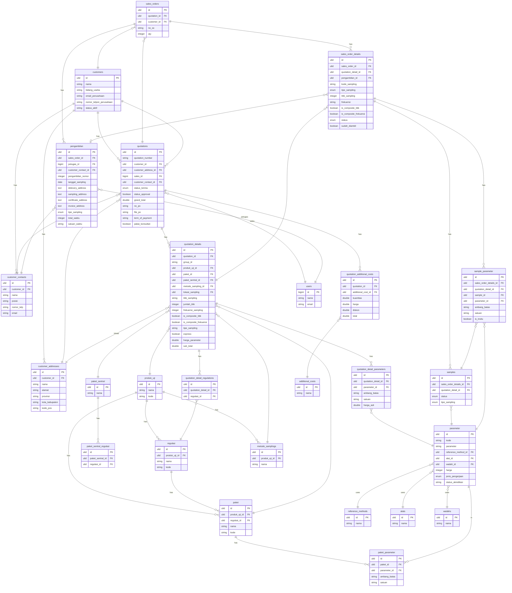

# ERD

> Generated from migrations. Entities in the ERD design that are not yet implemented are listed at the bottom.

## Planned Schema Changes

Column additions planned in issue plans — not yet migrated.

### `samples` table — UC-18/19, UC-24
| Column | Type | Plan | Purpose |
|---|---|---|---|
| `kode_sampling` | varchar nullable | UC-18/19 | scan lookup key; copy from SOD at creation |
| `received_at` | timestamp nullable | UC-18/19 | set on QR scan; drives queue readiness |
| `catatan_abnormalitas` | text nullable | UC-18/19 | abnormality notes recorded on intake |

### `sales_order_details` table — UC-24
| Column | Type | Plan | Purpose |
|---|---|---|---|
| `express` | boolean default false | UC-24 | denormalized from `quotation_details.express` for queue sorting |

### `sample_parameter` table — UC-24
| Column | Type | Plan | Purpose |
|---|---|---|---|
| `status` | varchar(20) default 'antrian' | UC-24 | `antrian → pengujian → selesai` |
| `analyst_id` | ulid nullable FK→users | UC-24 | analyst who took the ticket |
| `hasil` | text nullable | UC-24 | test result |
| `tested_at` | timestamp nullable | UC-24 | when result was entered |

### `parameter` table — UC-24
| Column | Type | Plan | Purpose |
|---|---|---|---|
| `durasi_hari` | integer nullable | UC-24 | wait days after receipt before sample enters queue |

---

## Not Yet Implemented

New tables with no migration yet.

| Entity | Needed for Use Case | Plan |
|---|---|---|
| `jadwal_pengujian` | UC-20-22 | [uc-20-22-planning-pengujian/plan.md](../issues/uc-20-22-planning-pengujian/plan.md) |
| `keahlian` | UC-10 Pilih Teknisi | — |
| `jadwal` / `jadwal_pengambilan` | UC-11, UC-12 | — |
| `worksheet_pengujian` | UC-16, UC-17, UC-25 | Blocked by SYS-01 |
| `bahan` / `bahan_pengujian` | UC-24 Ambil tiket | — |
| `alat_so` | UC-20 Pilih alat pengujian | — |
| `customer_credit` / `company_transactions` | Finance — **out of scope, separate microservice** | — |
| `job_history` | Internal resource tracking | — |
