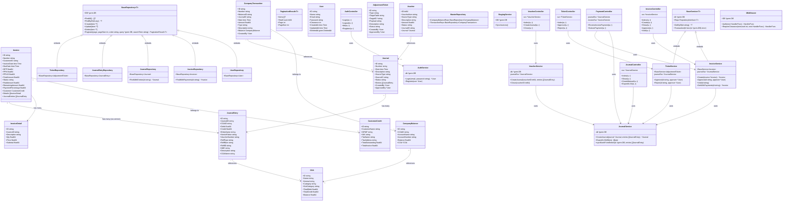

# Class Diagram

_Mermaid format. Shows Go structs, generics, and layer relationships. Updated when architecture changes._

```mermaid
classDiagram

    %% ─── Generic Base Types ───────────────────────────────────────

    class BaseRepository~T~ {
        +DB *gorm.DB
        +FindAll() []T
        +FindByID(id any) *T
        +Create(item *T)
        +Update(item *T)
        +Delete(item *T)
        +Paginate(page, pageSize int, order string, query *gorm.DB, searchTerm string) PaginationResult~T~
    }

    class BaseService~T~ {
        -db *gorm.DB
        +Repo RepositoryInterface~T~
        +GetByID(id string) *T
        +Transaction(fn func(tx *gorm.DB) error)
    }

    class PaginationResult~T~ {
        +Items []T
        +TotalCount int64
        +Page int
        +PageSize int
    }

    %% ─── Models ───────────────────────────────────────────────────

    class User {
        +ID string
        +Name string
        +Email string
        -Password string
        +Clearance int
        +CreatedAt time.Time
        +UpdatedAt time.Time
        +DeletedAt gorm.DeletedAt
    }

    class COA {
        +ID string
        +Name string
        +Normal string
        +Category string
        +SubCategory string
        +TotalDebit float64
        +TotalCredit float64
        +Balance float64
    }

    class CompanyBalance {
        +ID string
        +COAID string
        +AccountName string
        +AccountNumber string
        +Balance float64
        +COA *COA
    }

    class CompanyTransaction {
        +ID string
        +Number string
        +BalanceID string
        +JournalID string
        +Date time.Time
        +Amount float64
        +Type string
        +Description string
        +Balance CompanyBalance
        +CreatedBy *User
    }

    class CustomerCredit {
        +ID string
        +CustomerName string
        +NPWP string
        +NIK string
        +TaxName string
        +TaxAddress string
        +TotalOutstanding float64
        +TotalInvoice float64
    }

    class Invoice {
        +ID string
        +Number string
        +CustomerID string
        +InvoiceDate time.Time
        +DueDate time.Time
        +DPP float64
        +PPN float64
        +PPh23 float64
        +TotalAmount float64
        +Status string
        +PaidAmount float64
        +RemainingAmount float64
        +PaymentPercentage float64
        +Customer CustomerCredit
        +Details []InvoiceDetail
        +JournalEntries []JournalEntry
    }

    class InvoiceDetail {
        +ID string
        +InvoiceID string
        +Description string
        +Qty float64
        +Price float64
        +Subtotal float64
    }

    class Journal {
        +ID string
        +Number string
        +Date time.Time
        +Description string
        +SourceType string
        +SourceID string
        +Status string
        +Entries []JournalEntry
        +CreatedBy *User
        +ApprovedBy *User
    }

    class JournalEntry {
        +ID string
        +JournalID string
        +COAID string
        +Debit float64
        +Credit float64
        +EntityName string
        +NomorFaktur string
        +VoucherNumber string
        +ReffType string
        +ReffNum string
        +ReffID string
        +NDE string
        +Description string
        +COAName string
    }

    class AdjustmentTicket {
        +ID string
        +Type string
        +TargetTable string
        +TargetID *string
        +Payload string
        +Description string
        +Status string
        +CreatedBy *User
        +ApprovedBy *User
    }

    class Voucher {
        +ID int64
        +VoucherNum string
        +SourceType string
        +Description string
        +Amount float64
        +Status string
        +JournalID string
        +Journal *Journal
    }

    %% ─── Repositories ─────────────────────────────────────────────

    class UserRepository {
        +BaseRepository~User~
    }

    class InvoiceRepository {
        +BaseRepository~Invoice~
        +FindWithPayments(id string) *Invoice
    }

    class JournalRepository {
        +BaseRepository~Journal~
        +FindWithEntries(id string) *Journal
    }

    class JournalEntryRepository {
        +BaseRepository~JournalEntry~
    }

    class TicketRepository {
        +BaseRepository~AdjustmentTicket~
    }

    class MasterRepository {
        +CompanyBalanceRepo BaseRepository~CompanyBalance~
        +TransactionRepo BaseRepository~CompanyTransaction~
    }

    %% ─── Services ─────────────────────────────────────────────────

    class AuthService {
        -db *gorm.DB
        +Login(email, password string) *User
        +Register(user *User)
    }

    class InvoiceService {
        +BaseService~Invoice~
        -journalSvc *JournalService
        +Create(invoice *Invoice) *Invoice
        +Approve(id string, approver *User)
        +Void(id string)
        +GetWithPayments(id string) *Invoice
    }

    class JournalService {
        -db *gorm.DB
        +CreateJournal(journal *Journal, entries []JournalEntry) *Journal
        +ExportXLSX(filters) []byte
        +syncBankFromEntries(tx *gorm.DB, entries []JournalEntry)
    }

    class TicketService {
        +BaseService~AdjustmentTicket~
        -journalSvc *JournalService
        +Approve(id string, approver *User)
        +Reject(id string, approver *User)
    }

    class VoucherService {
        -db *gorm.DB
        -journalSvc *JournalService
        +CreateJournal(voucherID int64, entries []JournalEntry)
        +Close(voucherID int64)
    }

    class StagingService {
        +DB *gorm.DB
        +SyncInvoices()
    }

    %% ─── Controllers ──────────────────────────────────────────────

    class AuthController {
        +Login(w, r)
        +Logout(w, r)
        +Me(w, r)
        +Register(w, r)
    }

    class InvoiceController {
        -svc *InvoiceService
        +Index(w, r)
        +Create(w, r)
        +Show(w, r)
        +Approve(w, r)
        +Void(w, r)
    }

    class PaymentController {
        -journalSvc *JournalService
        -invoiceSvc *InvoiceService
        +ReceiveInvoicePayment(w, r)
        +SubconPayment(w, r)
    }

    class JournalController {
        -svc *JournalService
        +Index(w, r)
        +Show(w, r)
        +CreateManual(w, r)
        +ExportXLSX(w, r)
    }

    class TicketController {
        -svc *TicketService
        +Index(w, r)
        +Approve(w, r)
        +Reject(w, r)
    }

    class VoucherController {
        -svc *VoucherService
        +Index(w, r)
        +CreateJournal(w, r)
        +Close(w, r)
    }

    %% ─── Middleware ───────────────────────────────────────────────

    class Middleware {
        +DB *gorm.DB
        +Auth(next HandlerFunc) HandlerFunc
        +RequireClearance(minLevel int, next HandlerFunc) HandlerFunc
    }

    %% ─── Inheritance / Composition ────────────────────────────────

    BaseRepository~T~ <|-- UserRepository : embeds
    BaseRepository~T~ <|-- InvoiceRepository : embeds
    BaseRepository~T~ <|-- JournalRepository : embeds
    BaseRepository~T~ <|-- JournalEntryRepository : embeds
    BaseRepository~T~ <|-- TicketRepository : embeds

    BaseService~T~ <|-- InvoiceService : embeds
    BaseService~T~ <|-- TicketService : embeds

    %% ─── Service Dependencies ─────────────────────────────────────

    InvoiceService --> JournalService : uses
    TicketService --> JournalService : uses
    VoucherService --> JournalService : uses
    PaymentController --> JournalService : uses
    PaymentController --> InvoiceService : uses

    %% ─── Controller → Service ─────────────────────────────────────

    AuthController --> AuthService : uses
    InvoiceController --> InvoiceService : uses
    JournalController --> JournalService : uses
    TicketController --> TicketService : uses
    VoucherController --> VoucherService : uses

    %% ─── Model Associations ───────────────────────────────────────

    Invoice "1" --> "1" CustomerCredit : belongs to
    Invoice "1" --> "*" InvoiceDetail : has many
    Invoice "1" --> "*" JournalEntry : has many (via service)
    Journal "1" --> "*" JournalEntry : has many
    JournalEntry "*" --> "1" COA : references
    CompanyBalance "1" --> "1" COA : references
    CompanyTransaction "*" --> "1" CompanyBalance : belongs to
    CompanyTransaction "*" --> "0..1" Journal : references
    Voucher "*" --> "0..1" Journal : references
```
