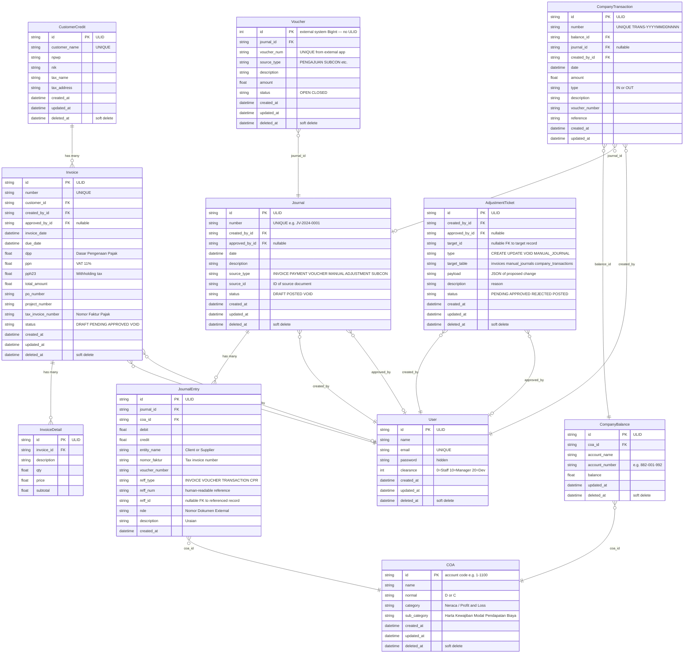

# Entity Relationship Diagram

_Mermaid format. Updated when models change._



---

## Key Relationships Summary

```
CustomerCredit  ──< Invoice ──< InvoiceDetail
Invoice         ────────────────────► Journal  (approval,  source_type=INVOICE)
Invoice+Payment ────────────────────► Journal  (payment,   source_type=PAYMENT)
Voucher         ────────────────────► Journal  (source_type=VOUCHER|SUBCON)
AdjustmentTicket ───────────────────► Journal  (approval,  source_type=ADJUSTMENT)
Journal         ──────────────────< JournalEntry
JournalEntry (bank COA) ────────────► CompanyTransaction  (auto-sync via syncBankFromEntries)
CompanyTransaction ──────────────────► CompanyBalance      (balance updated)
CompanyBalance  ────────────────────► COA
```
